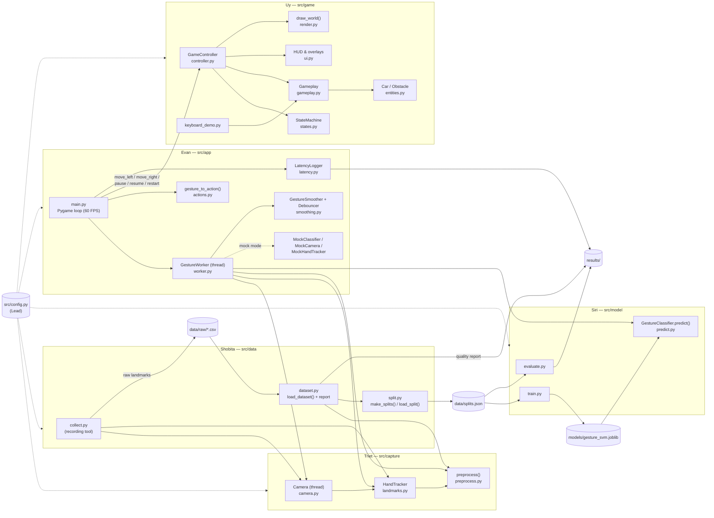

# Gesture-Controlled Car Dodging Game — Architecture & Design

**Course:** CSCI218 group project
**Status:** Design contract (v1.1, new team assignment). Every team member codes against these documents. If you need to change an interface, open a PR that edits the relevant file in `docs/` first. The Lead reviews it, and only then do you change code.

---

## Table of contents

| File | Sections |
|---|---|
| [`docs/DESIGN.md`](DESIGN.md) | [1. Overview & goals](#1-overview--goals)<br/>[2. System architecture](#2-system-architecture)<br/>[16. Requirements traceability](#16-requirements-traceability) |
| [`docs/interfaces.md`](interfaces.md) | [3. Repository structure](interfaces.md#3-repository-structure)<br/>[4. Interface specifications](interfaces.md#4-interface-specifications) |
| [`docs/game-logic.md`](game-logic.md) | [5. Game state machine](game-logic.md#5-game-state-machine)<br/>[6. Gesture pipeline details & `config.py`](game-logic.md#6-gesture-pipeline-details--configpy) |
| [`docs/data-eval.md`](data-eval.md) | [7. Dataset plan](data-eval.md#7-dataset-plan)<br/>[8. Evaluation plan](data-eval.md#8-evaluation-plan) |
| [`docs/workflow.md`](workflow.md) | [9. Testing plan](workflow.md#9-testing-plan)<br/>[10. Per-person task breakdown](workflow.md#10-per-person-task-breakdown)<br/>[11. Development plan (5 iterations)](workflow.md#11-development-plan-5-iterations)<br/>[12. Git workflow](workflow.md#12-git-workflow)<br/>[13. Coding standards](workflow.md#13-coding-standards) |
| [`docs/risks.md`](risks.md) | [15. Risks & mitigations](risks.md#15-risks--mitigations) |
| [`docs/notes/TEMPLATE.md`](notes/TEMPLATE.md) | [14. Technical notes template](notes/TEMPLATE.md#14-technical-notes-template) |

## Who reads what

| Role | Must read | Skim |
|---|---|---|
| Lead | Everything; owns [§1](#1-overview--goals), [§2](#2-system-architecture), [§3](interfaces.md#3-repository-structure), [§6.5](game-logic.md#65-srcconfigpy--all-named-constants-lead-creates-in-iteration-1), [§12](workflow.md#12-git-workflow), [§15](risks.md#15-risks--mitigations), [§16](#16-requirements-traceability) | – |
| Triet (Hand tracking) | [§4.2](interfaces.md#42-triet-hand-tracking--srccapture), [§6.1](game-logic.md#61-preprocessing-preprocess-triet), [§2.2](#22-data-flow-from-webcam-frame-to-car-movement) (camera thread), [§9](workflow.md#9-testing-plan) (Triet rows), [§11](workflow.md#11-development-plan-5-iterations) | [§2](#2-system-architecture), [§7.2](data-eval.md#72-conditions), [§8.4](data-eval.md#84-robustness-lighting-distance-users), [§13](workflow.md#13-coding-standards), [§14](notes/TEMPLATE.md#14-technical-notes-template) |
| Uy (Car game) | [§4.3](interfaces.md#43-uy-car-game--srcgame-gameplay), [§4.4](interfaces.md#44-uy-car-game--srcgame-state--ui), [§5](game-logic.md#5-game-state-machine), [§6.5](game-logic.md#65-srcconfigpy--all-named-constants-lead-creates-in-iteration-1) (game constants), [§9](workflow.md#9-testing-plan) (Uy rows), [§11](workflow.md#11-development-plan-5-iterations) | [§2](#2-system-architecture), [§4.6](interfaces.md#46-evan-live-integration--srcapp) (mapping table), [§13](workflow.md#13-coding-standards), [§14](notes/TEMPLATE.md#14-technical-notes-template) |
| Shobita (Dataset) | [§4.5](interfaces.md#45-dataset--classifier--srcdata-shobita-srcmodel-siri) (`src/data`), [§7](data-eval.md#7-dataset-plan), [§8.5](data-eval.md#85-who-measures-what-and-output-formats), [§9](workflow.md#9-testing-plan) (Shobita rows), [§11](workflow.md#11-development-plan-5-iterations) | [§2](#2-system-architecture), [§4.2](interfaces.md#42-triet-hand-tracking--srccapture), [§6.1](game-logic.md#61-preprocessing-preprocess-triet), [§13](workflow.md#13-coding-standards), [§14](notes/TEMPLATE.md#14-technical-notes-template) |
| Siri (Classifier) | [§4.5](interfaces.md#45-dataset--classifier--srcdata-shobita-srcmodel-siri) (`src/model`), [§6.1](game-logic.md#61-preprocessing-preprocess-triet), [§6.4](game-logic.md#64-confidence-threshold-siri-applied-inside-gestureclassifierpredict), [§7.5](data-eval.md#75-cleaning-quality-report-and-trainvalidationtest-split), [§8.1](data-eval.md#81-gesture-accuracy-offline-siri), [§9](workflow.md#9-testing-plan) (Siri rows), [§11](workflow.md#11-development-plan-5-iterations) | [§2](#2-system-architecture), [§8.4](data-eval.md#84-robustness-lighting-distance-users), [§8.5](data-eval.md#85-who-measures-what-and-output-formats), [§13](workflow.md#13-coding-standards), [§14](notes/TEMPLATE.md#14-technical-notes-template) |
| Evan (Live integration) | [§2.2](#22-data-flow-from-webcam-frame-to-car-movement), [§4.6](interfaces.md#46-evan-live-integration--srcapp), [§5](game-logic.md#5-game-state-machine), [§6.2](game-logic.md#62-smoothing-gesturesmoother-evan), [§6.3](game-logic.md#63-debounce-debouncer-evan), [§8.2](data-eval.md#82-live-action-accuracy-evan-nice), [§8.3](data-eval.md#83-response-time-evan), [§9](workflow.md#9-testing-plan) (Evan rows), [§11](workflow.md#11-development-plan-5-iterations) | [§4.2](interfaces.md#42-triet-hand-tracking--srccapture), [§4.4](interfaces.md#44-uy-car-game--srcgame-state--ui), [§4.5](interfaces.md#45-dataset--classifier--srcdata-shobita-srcmodel-siri) (`predict.py`), [§13](workflow.md#13-coding-standards), [§14](notes/TEMPLATE.md#14-technical-notes-template) |

---

## 1. Overview & goals

The game is a simple car-dodging game controlled with a webcam. The player steers a car between **three lanes** to avoid falling obstacles and earns points for surviving. OpenCV captures the video and MediaPipe detects hand landmarks. A scikit-learn SVM, trained on our own labelled examples, recognises three gestures plus a rejection class. Pygame draws the game, the score and collisions.

### 1.1 Gesture → action contract

| Gesture (label) | Game action |
|---|---|
| Fist (`"fist"`) | Move one lane left |
| V sign (`"v_sign"`) | Move one lane right |
| Open palm (`"open_palm"`) | Pause the game |
| Steering gesture (`"fist"` / `"v_sign"`) while paused | Resume play **and** perform that movement |
| No meaningful gesture (`"none"`) | Nothing |
| No hand detected (internal token `"no_hand"`) | Auto-pause (safety) |

### 1.2 Requirements checklist

Each item has an ID. [Section 16](#16-requirements-traceability) maps every ID to a section and an owner.

**Project description**
- [ ] **R1** Three-lane car dodging game with falling obstacles.
- [ ] **R2** Player earns points for surviving.
- [ ] **R3** OpenCV captures webcam video.
- [ ] **R4** MediaPipe detects hand landmarks.
- [ ] **R5** Classifier trained on labelled examples recognises three gestures.
- [ ] **R6** Fist → left, V sign → right, open palm → pause, steering gesture while paused → resume + move.
- [ ] **R7** Pygame shows the game, the score and collisions.
- [ ] **R8** Evaluate gesture accuracy.
- [ ] **R9** Evaluate response time.
- [ ] **R10** Evaluate performance under different lighting, camera distances and users.

**Tech constraints**
- [ ] **T1** 64-bit Python 3.12 for everyone; MediaPipe version verified on 3.12; direct dependencies pinned exactly in `requirements.txt`; the full environment, including transitive dependencies, locked in `requirements.lock`; both re-verified on clean venvs on Windows and macOS.
- [ ] **T2** Libraries: OpenCV, MediaPipe, scikit-learn (SVM), Pygame, numpy, joblib, pytest.
- [ ] **T3** VS Code + Git + shared GitHub repo, with `main` protected (branch protection or team agreement) and optional CI.

**Triet – Hand tracking**
- [ ] **HT.1** Capture webcam video with OpenCV in a background thread (default), with timestamps.
- [ ] **HT.2** Detect hand landmarks with MediaPipe and display them.
- [ ] **HT.3** One shared `preprocess()` used by both training and live prediction: wrist-relative, scale-invariant, left hand mirrored to match right.
- [ ] **HT.4** Delivered early: Shobita's recording tool builds on it (critical path).

**Uy – Car game**
- [ ] **GM.1** Three lanes and a player car.
- [ ] **GM.2** Falling obstacles.
- [ ] **GM.3** Collision detection.
- [ ] **GM.4** Survival score.
- [ ] **GM.5** Speed increases gradually.
- [ ] **GM.6** Keyboard controls first, so the game is developed independently.
- [ ] **GM.7** Pause/resume, with a countdown and grace period after resume.
- [ ] **GM.8** Game over and restart.
- [ ] **GM.9** HUD showing score, recognised gesture and confidence.
- [ ] **GM.10** `GameController` is the only API the integration layer calls.

**Shobita – Dataset collection and preparation**
- [ ] **DS.1** Recording tool `collect.py`, built on Triet's functions: press a label key to start recording, press again (or Space) to stop; saves landmarks to CSV.
- [ ] **DS.2** Coordinate recording sessions with different people, lighting conditions and distances.
- [ ] **DS.3** Remove invalid samples.
- [ ] **DS.4** Dataset quality report.
- [ ] **DS.5** User-based train/validation/test split (`data/splits.json`): 1–2 users held out as the test set, and no user or recording session in two splits.

**Siri – Gesture classifier**
- [ ] **CL.1** Train and tune an SVM on processed landmarks, using the prepared splits.
- [ ] **CL.2** `"none"` label **and** a confidence threshold, so random poses don't trigger actions.
- [ ] **CL.3** Analyse commonly confused gestures.
- [ ] **CL.4** Evaluate the final model on the reserved test set: accuracy + confusion matrix.
- [ ] **CL.5** Save the model; provide `predict()`.

**Evan – Live integration**
- [ ] **LI.1** Connect hand tracking, classifier and game: camera → landmarks → preprocess → predict → game actions.
- [ ] **LI.2** Prediction smoothing (majority vote over a recent window), robust to low camera FPS.
- [ ] **LI.3** Debounce: a held gesture triggers only one lane change.
- [ ] **LI.4** Missing-hand handling: auto-pause safely when no hand is detected.
- [ ] **LI.5** Gesture-based pause/resume, including "steering gesture while paused → resume + move".
- [ ] **LI.6** Show the recognised gesture.
- [ ] **LI.7** Measure end-to-end latency.
- [ ] **LI.8** Starts early: a keyboard-driven mock classifier with the same interface as the real one.

**Fixed interfaces**
- [ ] **I1** Labels `"fist"`, `"v_sign"`, `"open_palm"`, `"none"`.
- [ ] **I2** CSV columns `user_id, condition, label, f0 … f62`. Landmarks only, never images.
- [ ] **I3** `preprocess(landmarks) -> np.ndarray` with shape (63,).
- [ ] **I4** `predict(features) -> tuple[str, float]`.
- [ ] **I5** `GameController`: `move_left()`, `move_right()`, `pause()`, `resume()`, `is_paused()`.
- [ ] **I6** Gesture→action mapping lives in one pure, unit-testable function.

### 1.3 Non-goals

- No images or video are ever saved to disk (privacy).
- No deep learning and no GPU requirement. Everything runs on a normal laptop CPU.
- No network features, accounts or online leaderboards.

### 1.4 Team and ownership

| Person | Role | Owns | Short name in tables |
|---|---|---|---|
| Lead | Orchestrator | Repo, `requirements.txt`/`requirements.lock`, `src/config.py`, interfaces (these docs), code review, merging, slides | Lead |
| Triet | Hand tracking | `src/capture/` (`camera.py`, `landmarks.py`, `preprocess.py`) | Triet |
| Uy | Car game (whole game) | `src/game/` (gameplay, entities, rendering, states, UI, `GameController`) | Uy |
| Shobita | Dataset collection and preparation | `src/data/` (`collect.py`, `dataset.py`, `split.py`) and everything under `data/` | Shobita |
| Siri | Gesture classifier | `src/model/` (`train.py`, `evaluate.py`, `predict.py`), `models/` | Siri |
| Evan | Live integration | `src/app/` (`main.py`, `worker.py`, `actions.py`, `smoothing.py`, `latency.py`, `mock_classifier.py`) | Evan |

**Workload note:** Uy's part merges the old gameplay and game-state/UI parts, so it is the heaviest. If Uy is behind at the end of Iteration 2, the Lead and Triet take over `src/game/ui.py`: the Lead does the overlays and Triet the HUD. Uy stays the owner and reviewer of `src/game/`. [Section 10](workflow.md#10-per-person-task-breakdown) has the details.

**Critical path: Triet → Shobita → Siri → Evan.**
1. Triet's `Camera`, `HandTracker` and `preprocess()` come first.
2. Shobita's recording tool and data are built on them.
3. Siri's model needs Shobita's splits.
4. Evan's final integration and latency measurement need Siri's model.

---

## 2. System architecture

### 2.1 Component diagram



**Dependency rules** (the Lead checks these in code review):

1. `src/game/*` never imports from `src/capture`, `src/data`, `src/model` or `src/app`. The game knows nothing about gestures except the `(label, confidence)` strings it shows on the HUD.
2. `src/data/*` imports only `src/capture` (`Camera`, `HandTracker`, `HandLandmarks`, `preprocess`, `row_to_landmarks`).
3. `src/model/*` imports only `src/data` (`Dataset`, `load_split`, `load_splits`) and, through it, Triet's `preprocess()`.
4. `src/app/*` is the only package that imports from more than two owners.
5. Everything may import `src/config.py`. `config.py` imports nothing from the project.
6. Integration code calls `GameController` only, never `Gameplay` or `StateMachine` directly (GM.10).
7. **Thread rules:**
   - Pygame and `GameController` are used **only on the main thread**.
   - `HandTracker` (MediaPipe) is created and used **only on the `GestureWorker` thread**.
   - Threads communicate only through the camera's latest-frame slot, the worker's latest-observation slot and the worker's event queue. All three are lock-protected.

### 2.2 Data flow: from webcam frame to car movement

The live game runs **three threads**. Camera capture runs in a background thread by default (`CAMERA_THREADED = True`). Gesture processing runs in its own worker thread. The Pygame loop renders at `TARGET_FPS = 60` regardless of camera speed and always uses the latest frame and prediction.

**Why threads:**
- In dim light many webcams drop to about 15 FPS. A single-threaded loop would then render the game at 15 FPS too.
- The worker always takes the **newest** frame, so stale frames never pile up and add latency.

```mermaid
sequenceDiagram
    autonumber
    participant CT as Camera thread (Triet)
    participant WT as GestureWorker thread (Evan)
    participant MT as Main / Pygame thread (Evan)
    participant GC as GameController (Uy)

    loop every camera frame (about 30 FPS; about 15 FPS in dim light)
        CT->>CT: cv2 read + horizontal flip + resize,<br/>t_capture = perf_counter()
        CT-->>WT: newest Frame (older unread frames are dropped)
        WT->>WT: HandTracker.detect → preprocess → Classifier.predict<br/>(label "none" if conf < threshold; token "no_hand" if no hand)
        WT->>WT: GestureSmoother (time window) → Debouncer
        WT-->>MT: latest GestureObservation (for the HUD)<br/>+ GestureEvent in queue (only on a debounced change)
    end
    loop every render frame (TARGET_FPS = 60)
        MT->>MT: poll_events() → gesture_to_action(event.token, controller.state)
        MT->>GC: apply_action → move_left / move_right / pause / resume / restart
        GC-->>MT: True if the game changed → t_action = perf_counter() → LatencyLogger
        MT->>GC: set_gesture_info(...), update(dt), render(screen)
        MT->>MT: draw camera.latest() preview thumbnail
    end
```

**Camera thread** (`Camera`, Triet). It loops on `cv2.VideoCapture.read()`. For each frame it mirrors horizontally (selfie view), resizes to 640×480 and stamps `t_capture = time.perf_counter()`. The frame goes into a single latest-frame slot, overwriting any frame the worker has not taken yet.

**GestureWorker thread** (`worker.py`, Evan). For every new frame:
1. `frame = camera.read()` blocks until a frame newer than the last one it returned arrives.
2. `hand = tracker.detect(frame.image)` returns a `HandLandmarks` or `None`.
3. If there is a hand: `features = preprocess(hand)`, then `label, conf = classifier.predict(features)`. `predict` itself returns `"none"` when `conf < CONFIDENCE_THRESHOLD`. If there is no hand, the raw token is `NO_HAND = "no_hand"` and the confidence is `0.0`.
4. `stable = smoother.update(token, frame.t_capture)` gives the majority vote over the last `SMOOTHING_WINDOW_S` seconds, with hysteresis ([Section 6.2](game-logic.md#62-smoothing-gesturesmoother-evan)). The worker also tracks the start of the current run of identical raw tokens (`streak_start` = `t_capture` of its first frame), which the response-time metric needs ([Section 8.3](data-eval.md#83-response-time-evan)).
5. `event = debouncer.update(stable, frame.t_capture)` returns a token only when the stable token changes (and the cooldown has passed). Otherwise it returns `None`.
6. The worker publishes a `GestureObservation` (raw token, confidence, stable token, hand present, timestamps) to its latest-observation slot. If there is an event, it also puts a `GestureEvent` into its queue.

**Main thread** (`main.py`, Evan). Once per render frame (60 FPS):
1. Handle Pygame/keyboard events, then copy the key state into the shared `KeyboardState` snapshot that the mocks read.
2. `for event in worker.poll_events()`: `action = gesture_to_action(event.token, controller.state)`; `changed = apply_action(controller, action)`; if `changed`, take `t_action = perf_counter()` and call `latency_logger.log_action(...)` ([Section 8.3](data-eval.md#83-response-time-evan)).
3. `obs = worker.latest()`, then `controller.set_gesture_info(obs.stable, obs.confidence, obs.hand_present)` updates the HUD.
4. `controller.update(dt)`, `controller.render(screen)`, then draw `camera.latest()` as the preview thumbnail.

Keyboard shortcuts work in **every** mode, both as a fallback and for demos: ←/→ move, `P` pauses or resumes, `R` restarts, `Esc` quits.

---

## 16. Requirements traceability

| ID | Requirement | Section(s) | Owner |
|---|---|---|---|
| R1 | Three-lane dodging game with falling obstacles | [4.3](interfaces.md#43-uy-car-game--srcgame-gameplay), [5](game-logic.md#5-game-state-machine), [6.5](game-logic.md#65-srcconfigpy--all-named-constants-lead-creates-in-iteration-1) | Uy |
| R2 | Points for surviving | [4.3](interfaces.md#43-uy-car-game--srcgame-gameplay) (`score`), [4.4](interfaces.md#44-uy-car-game--srcgame-state--ui) (HUD) | Uy |
| R3 | OpenCV webcam capture | [4.2](interfaces.md#42-triet-hand-tracking--srccapture) `Camera`, [2.2](#22-data-flow-from-webcam-frame-to-car-movement) | Triet |
| R4 | MediaPipe hand landmarks | [4.2](interfaces.md#42-triet-hand-tracking--srccapture) `HandTracker`, [3.1](interfaces.md#31-requirementstxt-and-requirementslock) | Triet |
| R5 | Classifier for three gestures trained on labelled examples | [4.5](interfaces.md#45-dataset--classifier--srcdata-shobita-srcmodel-siri), [7](data-eval.md#7-dataset-plan), [8.1](data-eval.md#81-gesture-accuracy-offline-siri) | Siri (model), Shobita (data) |
| R6 | Fist→left, V→right, palm→pause, steer-while-paused→resume+move | [1.1](#11-gesture--action-contract), [4.6](interfaces.md#46-evan-live-integration--srcapp) mapping table, [5](game-logic.md#5-game-state-machine) | Evan (mapping), Uy (controller) |
| R7 | Pygame shows game, score, collisions | [4.3](interfaces.md#43-uy-car-game--srcgame-gameplay) `render.py`, [4.4](interfaces.md#44-uy-car-game--srcgame-state--ui) `ui.py` | Uy |
| R8 | Evaluate gesture accuracy | [8.1](data-eval.md#81-gesture-accuracy-offline-siri), [8.2](data-eval.md#82-live-action-accuracy-evan-nice) | Siri, Evan |
| R9 | Evaluate response time | [8.3](data-eval.md#83-response-time-evan), [4.6](interfaces.md#46-evan-live-integration--srcapp) `latency.py` | Evan |
| R10 | Robustness: lighting, distance, users | [7.2](data-eval.md#72-conditions), [7.5](data-eval.md#75-cleaning-quality-report-and-trainvalidationtest-split), [8.4](data-eval.md#84-robustness-lighting-distance-users) | Siri, Shobita, Evan |
| T1 | 64-bit Python 3.12, verified MediaPipe, pins + lock file | [3.1](interfaces.md#31-requirementstxt-and-requirementslock), [15](risks.md#15-risks--mitigations) (#1) | Lead |
| T2 | Library set | [3.1](interfaces.md#31-requirementstxt-and-requirementslock) | Lead |
| T3 | VS Code + Git + GitHub, protection, optional CI | [11](workflow.md#11-development-plan-5-iterations) (Iteration 1), [12](workflow.md#12-git-workflow) | Lead |
| HT.1 | Threaded OpenCV capture with timestamps | [4.2](interfaces.md#42-triet-hand-tracking--srccapture) `Camera`, [2.2](#22-data-flow-from-webcam-frame-to-car-movement) | Triet |
| HT.2 | MediaPipe detection + landmark display | [4.2](interfaces.md#42-triet-hand-tracking--srccapture) `HandTracker` | Triet |
| HT.3 | One shared `preprocess()` (wrist-relative, scale-invariant, mirror left) | [4.2](interfaces.md#42-triet-hand-tracking--srccapture), [6.1](game-logic.md#61-preprocessing-preprocess-triet), [9](workflow.md#9-testing-plan) | Triet |
| HT.4 | Delivered early (critical path) | [1.4](#14-team-and-ownership), [10](workflow.md#10-per-person-task-breakdown), [11](workflow.md#11-development-plan-5-iterations) (Iteration 2) | Triet |
| GM.1 | Three lanes + player car | [4.3](interfaces.md#43-uy-car-game--srcgame-gameplay) `entities.py` | Uy |
| GM.2 | Falling obstacles | [4.3](interfaces.md#43-uy-car-game--srcgame-gameplay) `Gameplay.update` | Uy |
| GM.3 | Collision detection | [4.3](interfaces.md#43-uy-car-game--srcgame-gameplay) `collides`, [9](workflow.md#9-testing-plan) | Uy |
| GM.4 | Survival score | [4.3](interfaces.md#43-uy-car-game--srcgame-gameplay) | Uy |
| GM.5 | Gradual speed increase | [4.3](interfaces.md#43-uy-car-game--srcgame-gameplay), [6.5](game-logic.md#65-srcconfigpy--all-named-constants-lead-creates-in-iteration-1) | Uy |
| GM.6 | Keyboard controls first | [4.3](interfaces.md#43-uy-car-game--srcgame-gameplay) `keyboard_demo.py`, [10](workflow.md#10-per-person-task-breakdown) | Uy |
| GM.7 | Pause/resume with countdown/grace | [4.4](interfaces.md#44-uy-car-game--srcgame-state--ui), [5](game-logic.md#5-game-state-machine) (rule 3) | Uy |
| GM.8 | Game over, restart | [4.4](interfaces.md#44-uy-car-game--srcgame-state--ui), [5](game-logic.md#5-game-state-machine) | Uy |
| GM.9 | HUD: score, gesture, confidence | [4.4](interfaces.md#44-uy-car-game--srcgame-state--ui) `ui.py` | Uy (Lead/Triet backup) |
| GM.10 | `GameController` is the only API | [2.1](#21-component-diagram) (rule 6), [4.4](interfaces.md#44-uy-car-game--srcgame-state--ui) | Uy |
| DS.1 | Recording tool, start/stop by key press → CSV | [4.5](interfaces.md#45-dataset--classifier--srcdata-shobita-srcmodel-siri) `collect.py`, [7.4](data-eval.md#74-files-naming-privacy) | Shobita |
| DS.2 | Coordinate sessions: people, lighting, distances | [7.2](data-eval.md#72-conditions), [7.3](data-eval.md#73-amounts), [11](workflow.md#11-development-plan-5-iterations) (Iteration 3) | Shobita + everyone |
| DS.3 | Remove invalid samples | [4.5](interfaces.md#45-dataset--classifier--srcdata-shobita-srcmodel-siri) `dataset.py`, [7.5](data-eval.md#75-cleaning-quality-report-and-trainvalidationtest-split) | Shobita |
| DS.4 | Dataset quality report | [4.5](interfaces.md#45-dataset--classifier--srcdata-shobita-srcmodel-siri) `dataset.py`, [7.5](data-eval.md#75-cleaning-quality-report-and-trainvalidationtest-split), [8.5](data-eval.md#85-who-measures-what-and-output-formats) | Shobita |
| DS.5 | User-based train/validation/test split | [4.5](interfaces.md#45-dataset--classifier--srcdata-shobita-srcmodel-siri) `split.py`, [7.5](data-eval.md#75-cleaning-quality-report-and-trainvalidationtest-split), [9](workflow.md#9-testing-plan) | Shobita |
| CL.1 | Train + tune SVM on processed landmarks from splits | [4.5](interfaces.md#45-dataset--classifier--srcdata-shobita-srcmodel-siri) `train.py`, [8.1](data-eval.md#81-gesture-accuracy-offline-siri) | Siri |
| CL.2 | `none` label + confidence threshold | [6.4](game-logic.md#64-confidence-threshold-siri-applied-inside-gestureclassifierpredict), [7.1](data-eval.md#71-labels-and-what-to-record) | Siri |
| CL.3 | Analyse confused gestures | [8.1](data-eval.md#81-gesture-accuracy-offline-siri) | Siri |
| CL.4 | Test-set evaluation: accuracy + confusion matrix | [8.1](data-eval.md#81-gesture-accuracy-offline-siri), [4.5](interfaces.md#45-dataset--classifier--srcdata-shobita-srcmodel-siri) `evaluate.py` | Siri |
| CL.5 | Save model, provide `predict()` | [4.5](interfaces.md#45-dataset--classifier--srcdata-shobita-srcmodel-siri) `predict.py` | Siri |
| LI.1 | camera → landmarks → preprocess → predict → actions | [2.2](#22-data-flow-from-webcam-frame-to-car-movement), [4.6](interfaces.md#46-evan-live-integration--srcapp) `worker.py`, `main.py` | Evan |
| LI.2 | Smoothing (time-window majority vote, low-FPS robust) | [6.2](game-logic.md#62-smoothing-gesturesmoother-evan) | Evan |
| LI.3 | Debounce: held gesture = one lane change | [6.3](game-logic.md#63-debounce-debouncer-evan), [9](workflow.md#9-testing-plan) | Evan |
| LI.4 | Auto-pause when no hand | [4.1](interfaces.md#41-shared-srcconfigpy-lead) `NO_HAND`, [4.6](interfaces.md#46-evan-live-integration--srcapp), [5](game-logic.md#5-game-state-machine) (rule 4) | Evan |
| LI.5 | Gesture-based pause/resume (+ resume-and-move) | [4.6](interfaces.md#46-evan-live-integration--srcapp) mapping table, [5](game-logic.md#5-game-state-machine) (rule 2) | Evan |
| LI.6 | Display recognised gesture | [4.4](interfaces.md#44-uy-car-game--srcgame-state--ui) `set_gesture_info`, `draw_hud` | Evan → Uy |
| LI.7 | Measure end-to-end latency | [8.3](data-eval.md#83-response-time-evan), [4.6](interfaces.md#46-evan-live-integration--srcapp) `latency.py` | Evan |
| LI.8 | Mock classifier with same interface from day 1 | [4.5](interfaces.md#45-dataset--classifier--srcdata-shobita-srcmodel-siri) `Classifier`, [4.6](interfaces.md#46-evan-live-integration--srcapp) mocks, [11](workflow.md#11-development-plan-5-iterations) (Iteration 1) | Evan, Lead |
| I1 | Labels | [4.1](interfaces.md#41-shared-srcconfigpy-lead) | Lead |
| I2 | CSV columns, landmarks only | [4.5](interfaces.md#45-dataset--classifier--srcdata-shobita-srcmodel-siri) CSV schema, [7.4](data-eval.md#74-files-naming-privacy) | Shobita |
| I3 | `preprocess(landmarks) -> np.ndarray (63,)` | [4.2](interfaces.md#42-triet-hand-tracking--srccapture), [6.1](game-logic.md#61-preprocessing-preprocess-triet) | Triet |
| I4 | `predict(features) -> tuple[str, float]` | [4.5](interfaces.md#45-dataset--classifier--srcdata-shobita-srcmodel-siri) `predict.py` | Siri |
| I5 | `GameController` methods | [4.4](interfaces.md#44-uy-car-game--srcgame-state--ui) | Uy |
| I6 | Single pure gesture→action function | [4.6](interfaces.md#46-evan-live-integration--srcapp) `gesture_to_action` | Evan |
