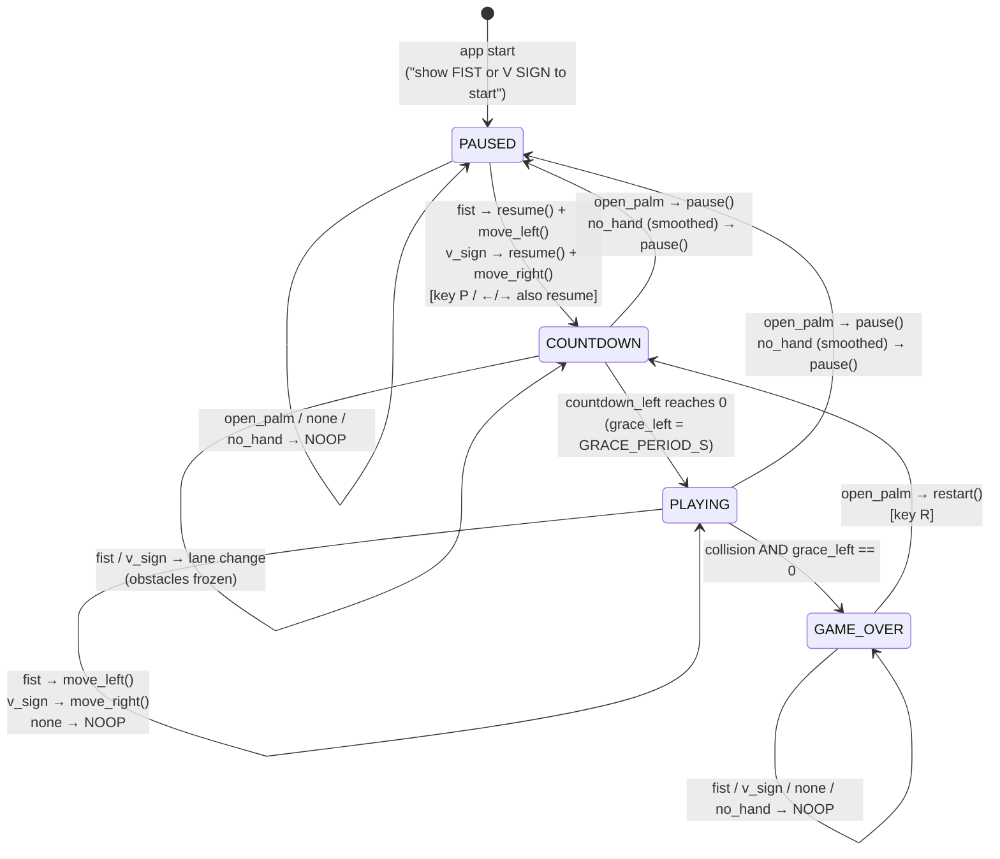

# Game State Machine & Gesture Pipeline

Part of the design docs — start at [DESIGN.md](DESIGN.md) for the index.

---

## 5. Game state machine



The states and transitions are implemented by Uy (`states.py`, `controller.py`). The gesture-to-transition mapping is implemented by Evan (`actions.py`).

Rules:

1. **Start paused.** The game starts in `PAUSED`, so nothing moves until the player shows a steering gesture. That gesture both starts the game and moves the car.
2. **Steering gesture while paused → resume + move.** `PAUSED` + `fist` → `RESUME_AND_LEFT` → `resume()` (→ `COUNTDOWN`) then `move_left()`.
3. **Countdown and grace period.** After `resume()`/`restart()`, `COUNTDOWN` lasts `RESUME_COUNTDOWN_S = 2.0` s. During it obstacles are frozen but the car can change lanes. Then `PLAYING` starts with `GRACE_PERIOD_S = 0.75` s of collision immunity, and the car blinks. So an obstacle that was right above the car when the game paused cannot hit it immediately.
4. **No hand → pause.** When the *smoothed* token becomes `no_hand`, `PLAYING`/`COUNTDOWN` → `PAUSED`. That needs at least 60% of the frames in the last 0.25 s to have no hand, which is about 150 ms of missing hand at any frame rate ([Section 6.2](#62-smoothing-gesturesmoother-evan)). A single dropped detection never pauses the game.
5. **Game over** happens only from `PLAYING`, on a collision once the grace period has ended. Score and gameplay freeze.
6. **Restart** is a transition, not a state: `restart()` resets `Gameplay` and goes to `COUNTDOWN`.
7. **The keyboard mirrors gestures** in every state: ← = fist, → = v_sign, `P` = open palm in PLAYING/COUNTDOWN and resume (without moving) in PAUSED, `R` = restart from any state, `Esc` = quit.

---

## 6. Gesture pipeline details & `config.py`

### 6.1 Preprocessing (`preprocess()`, Triet)

| Step | Operation | Why |
|---|---|---|
| 0 | Validate: `points.shape == (21, 3)`, all finite, `handedness ∈ {"Left","Right"}`; else `ValueError`. Copy as `float64`. | Fail early and loudly. Never mutate the caller's data. |
| 1 | `p[:, [0, 2]] *= FRAME_WIDTH / FRAME_HEIGHT` (x and z × 4/3) | MediaPipe normalises x by width and y by height. This makes x and y share one unit, so the hand shape is not stretched. MediaPipe expresses z on x's scale, so z gets the same factor. |
| 2 | `p -= p[WRIST_IDX]` (landmark 0) | **Translation invariance:** the result does not depend on where the hand is in the frame. |
| 3 | If `handedness == "Left"`: `p[:, 0] *= -1` | **Mirror the left hand onto the right**, so one model handles both hands. |
| 4 | `palm = ‖p[MIDDLE_MCP_IDX, :2]‖` (wrist → middle-finger MCP, landmark 9, in the x–y plane). If `palm < MIN_PALM_SIZE`, `ValueError`. Else `p /= palm`. | **Scale invariance** (camera distance, hand size). Palm length barely changes between gestures, unlike "max distance", which is much smaller for a fist. Using only x–y avoids the noisy z. |
| 5 | `return p.reshape(-1).astype(np.float32)` | Shape (63,), order `[x0,y0,z0,…]`, the same order as CSV `f0..f62`. |

We do **not** remove rotation. A tilted hand still has the same finger configuration, and keeping rotation helps the classifier distinguish real gestures from random hand poses. If the evaluation shows tilt causes errors, a later `PREPROCESS_VERSION = 2` can add roll normalisation. Because the CSVs store raw values, we just retrain (see [Section 15](risks.md#15-risks--mitigations)).

### 6.2 Smoothing (`GestureSmoother`, Evan)

The window is defined in **time**, not in frames, because the camera frame rate is not constant. Most webcams deliver about 30 FPS in good light but lower their frame rate to about 15 FPS in dim light, because each frame needs a longer exposure. A fixed "last 7 frames" window would be 233 ms at 30 FPS but 467 ms at 15 FPS, so the game would feel twice as sluggish in the dark. A time window keeps the response roughly constant.

**Algorithm.** `update(token, t)` is called once per processed frame, with `t = Frame.t_capture`:
1. Append `(t, token)`. Drop entries older than `t − SMOOTHING_WINDOW_S` (0.25 s), **but always keep at least the last `SMOOTHING_MIN_FRAMES` (3) entries**. At very low FPS the window therefore stretches to cover 3 frames instead of becoming empty.
2. If the window holds fewer than `SMOOTHING_MIN_FRAMES` entries (only right after start), `stable` stays unchanged.
3. Let `c` be the count of the most common token and `n` the window size. If `c / n ≥ SMOOTHING_MIN_FRACTION` (0.6), that token becomes `stable`. Otherwise `stable` **keeps its previous value** (hysteresis). This stops brief ambiguous frames from flipping the output and causing double triggers.
4. Ties are impossible, because `SMOOTHING_MIN_FRACTION > 0.5`.

**Resulting behaviour:**

| Camera FPS | Frames in 0.25 s window | Needed for a switch | Delay added to a clean gesture change |
|---|---|---|---|
| 30 | ~8 | 5 of 8 | ≈ 150–170 ms |
| 15 | ~4 | 3 of 4 (≥ 0.6) | ≈ 150–200 ms |
| 8 (very dark) | 3 (min-frames rule) | 2 of 3 | ≈ 250 ms |

- The delay stays around `SMOOTHING_MIN_FRACTION × SMOOTHING_WINDOW_S` ≈ 150 ms from 15 to 30 FPS.
- **No-hand pause** uses the same rule. It needs about 150 ms of missing hand at any frame rate, so one dropped detection never pauses the game.
- If the worker's FPS falls below `LOW_FPS_WARNING` (10), the HUD shows the FPS in orange so players know the lighting is too poor.

### 6.3 Debounce (`Debouncer`, Evan)

```text
state: last_stable = NO_HAND, last_emit_time = -inf

update(stable, now):                     # now = Frame.t_capture (seconds, not frames)
    if stable == last_stable:            # gesture is being HELD → never re-trigger
        return None
    last_stable = stable                 # a change happened
    if stable in {LABEL_NONE}:           # releasing to "none" is never an event
        return None
    if stable in {LABEL_FIST, LABEL_V_SIGN} and now - last_emit_time < ACTION_COOLDOWN_S:
        return None                      # rate-limit lane changes only (pause/no_hand always pass)
    if stable in {LABEL_FIST, LABEL_V_SIGN}:
        last_emit_time = now
    return stable
```

Consequences:

- Holding a fist for 5 s moves the car **once** (LI.3).
- To move twice to the left: fist → relax (`none`) → fist. Each fist edge is one event, and they must be at least `ACTION_COOLDOWN_S = 0.30` s apart.
- fist → v_sign directly is two different edges, so the car moves left then right.
- Pause events (`open_palm`, `no_hand`) are never rate-limited, because safety comes first.
- If a lane-change edge is swallowed by the cooldown, it is **not** queued. The user repeats the gesture. Queued moves would feel laggy.
- The cooldown is measured in seconds of capture time, so it behaves the same at 15 and 30 FPS.

### 6.4 Confidence threshold (Siri, applied inside `GestureClassifier.predict`)

- `CONFIDENCE_THRESHOLD = 0.70`. Below it, the label becomes `"none"`.
- Together with the trained `"none"` class this gives two layers of rejection (CL.2). The `"none"` class catches *known* non-gestures. The threshold catches *unseen* poses the model is unsure about.
- Siri tunes the value in Iteration 3 on the **validation** predictions: the leave-one-user-out out-of-fold predictions over the train users ([Section 8.1](data-eval.md#81-gesture-accuracy-offline-siri)). **Never on the test set.** Siri picks the smallest threshold in 0.40–0.95 that keeps the false-trigger rate on true-`none` samples ≤ 5%, and writes the value back into `config.py`.

### 6.5 `src/config.py` — all named constants (Lead creates in Iteration 1)

```python
"""Central configuration. Every tunable number lives here — never hard-code these elsewhere."""
from pathlib import Path

# ---------- Paths ----------
ROOT_DIR: Path = Path(__file__).resolve().parent.parent
DATA_DIR: Path = ROOT_DIR / "data" / "raw"
SAMPLE_DIR: Path = ROOT_DIR / "data" / "sample"
SPLITS_PATH: Path = ROOT_DIR / "data" / "splits.json"
SAMPLE_SPLITS_PATH: Path = SAMPLE_DIR / "splits.json"
MODEL_PATH: Path = ROOT_DIR / "models" / "gesture_svm.joblib"
RESULTS_DIR: Path = ROOT_DIR / "results"
SEED: int = 218

# ---------- Labels ----------
LABEL_FIST, LABEL_V_SIGN, LABEL_OPEN_PALM, LABEL_NONE = "fist", "v_sign", "open_palm", "none"
LABELS: tuple[str, ...] = (LABEL_FIST, LABEL_V_SIGN, LABEL_OPEN_PALM, LABEL_NONE)
NO_HAND: str = "no_hand"                    # pipeline token only (not a classifier label)

# ---------- Camera (Triet) ----------
CAMERA_INDEX: int = 0
FRAME_WIDTH: int = 640                      # px
FRAME_HEIGHT: int = 480                     # px
CAMERA_FPS: int = 30                        # requested; actual may be lower (≈15 in dim light)
MIRROR_FRAME: bool = True
CAMERA_THREADED: bool = True                # capture in a background thread (default)
CAMERA_READ_TIMEOUT_S: float = 1.0          # s, Camera.read() waits this long for a new frame
CAMERA_MAX_FAILED_READS: int = 5

# ---------- MediaPipe (Triet) ----------
MP_MAX_NUM_HANDS: int = 1
MP_MODEL_COMPLEXITY: int = 0                # 0 = fastest model; switch to 1 only if accuracy demands it
MP_MIN_DETECTION_CONFIDENCE: float = 0.6
MP_MIN_TRACKING_CONFIDENCE: float = 0.5

# ---------- Landmarks / preprocessing (Triet) ----------
NUM_LANDMARKS: int = 21
NUM_COORDS: int = 3
NUM_FEATURES: int = NUM_LANDMARKS * NUM_COORDS   # 63
WRIST_IDX: int = 0
MIDDLE_MCP_IDX: int = 9
MIN_PALM_SIZE: float = 1e-6                 # in aspect-corrected normalised units
PREPROCESS_VERSION: int = 1

# ---------- Data collection & preparation (Shobita) ----------
LIGHTING_CONDITIONS: tuple[str, ...] = ("bright", "dim", "backlit")
DISTANCE_CONDITIONS: tuple[str, ...] = ("near", "far")
CONDITIONS: tuple[str, ...] = tuple(f"{l}_{d}" for l in LIGHTING_CONDITIONS for d in DISTANCE_CONDITIONS)
CORE_CONDITIONS: tuple[str, ...] = ("bright_near", "bright_far", "dim_near", "dim_far")
RECORD_SAMPLE_HZ: float = 10.0              # rows per second while recording is ON
RECORD_START_DELAY_S: float = 1.0           # s between pressing a label key and the first sample
RECORD_TARGET_PER_LABEL: int = 80           # rows per label per condition per user (auto-stop)
MIN_ROWS_PER_CELL: int = 60                 # quality report flags user×condition×label cells below this
OUT_OF_FRAME_MARGIN: float = 0.05           # landmark x/y outside [-margin, 1+margin] counts as out of frame
MAX_OUT_OF_FRAME_LANDMARKS: int = 5         # gesture rows with more out-of-frame landmarks are dropped
N_TEST_USERS: int = 2                       # users held out entirely as the test set
CSV_FEATURE_COLUMNS: tuple[str, ...] = tuple(f"f{i}" for i in range(NUM_FEATURES))
CSV_COLUMNS: tuple[str, ...] = ("user_id", "condition", "label", *CSV_FEATURE_COLUMNS, "handedness")

# ---------- Classifier (Siri) ----------
SVM_C: float = 10.0
SVM_GAMMA: float | str = "scale"
SVM_GRID_C: tuple[float, ...] = (1.0, 10.0, 100.0)
SVM_GRID_GAMMA: tuple[float | str, ...] = ("scale", 0.01, 0.1)
CONFIDENCE_THRESHOLD: float = 0.70

# ---------- Live pipeline (Evan) ----------
SMOOTHING_WINDOW_S: float = 0.25            # s of capture time in the majority-vote window
SMOOTHING_MIN_FRACTION: float = 0.6         # share of the window a token needs to become stable (> 0.5)
SMOOTHING_MIN_FRAMES: int = 3               # window never shrinks below this many frames (low-FPS guard)
ACTION_COOLDOWN_S: float = 0.30             # s between lane-change events
LOW_FPS_WARNING: float = 10.0               # HUD shows FPS in orange below this
SHOW_CAMERA_PREVIEW: bool = True
PREVIEW_SIZE: tuple[int, int] = (160, 120)  # px, drawn top-right below HUD

# ---------- Game window & timing (Uy) ----------
WINDOW_WIDTH: int = 480                     # px (3 lanes × 160 px)
WINDOW_HEIGHT: int = 720                    # px
HUD_HEIGHT: int = 48                        # px
TARGET_FPS: int = 60                        # Pygame render rate, independent of camera FPS
MAX_DT: float = 0.1                         # s, clamp per update

# ---------- Gameplay (Uy) ----------
NUM_LANES: int = 3
LANE_WIDTH: float = WINDOW_WIDTH / NUM_LANES   # 160 px
CAR_WIDTH: float = 70.0
CAR_HEIGHT: float = 110.0
CAR_Y: float = WINDOW_HEIGHT - CAR_HEIGHT - 30.0
OBSTACLE_WIDTH: float = 90.0
OBSTACLE_HEIGHT: float = 70.0
BASE_SPEED: float = 220.0                   # px/s
SPEED_INCREASE_PER_SECOND: float = 6.0      # px/s per second of play
MAX_SPEED: float = 650.0                    # px/s
SPAWN_GAP_PX: float = 300.0                 # vertical distance between obstacle rows
DOUBLE_OBSTACLE_PROB: float = 0.25
SCORE_PER_SECOND: float = 10.0

# ---------- Game state (Uy) ----------
RESUME_COUNTDOWN_S: float = 2.0
GRACE_PERIOD_S: float = 0.75
```

`tests/test_imports.py` (Lead) asserts:
- `NUM_FEATURES == 63` and `len(CSV_COLUMNS) == 67`;
- `0.5 < SMOOTHING_MIN_FRACTION <= 1` and `SMOOTHING_MIN_FRAMES >= 1`;
- `set(CORE_CONDITIONS) <= set(CONDITIONS)`;
- `N_TEST_USERS >= 1`;
- `SPAWN_GAP_PX > CAR_HEIGHT + OBSTACLE_HEIGHT`, which guarantees there is room to dodge between rows.
