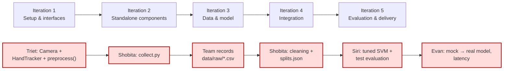

# Testing, Tasks, Iterations, Git & Coding Standards

Part of the design docs — start at [DESIGN.md](DESIGN.md) for the index.

---

## 9. Testing plan

- **Framework:** pytest. Everything runs headless: `tests/conftest.py` sets `os.environ["SDL_VIDEODRIVER"] = "dummy"` and `SDL_AUDIODRIVER = "dummy"` before importing pygame.
- **No hardware:** no test needs a webcam or a trained model file. Tests use synthetic landmarks, `data/sample/`, seeded RNGs, fake key states and a fake `cv2.VideoCapture` (monkeypatched).
- **Threads:** thread tests always `stop()`/`close()` in a `finally` block and assert that the thread has joined within 1 s, so a hanging thread fails the test instead of hanging the suite.
- **Merge rule:** `pytest` must pass on the PR branch before the Lead merges ([Section 12](#12-git-workflow)).

| Owner | Test file | Test cases (minimum) |
|---|---|---|
| **Triet** | `test_preprocess.py` | output shape `(63,)` and dtype `float32`; wrist maps to (0,0,0); **translation invariance** (shifting all points gives the same output); **scale invariance** (scaling about the wrist gives the same output); **left mirrored = right** (x-mirrored points with `"Left"` equal the original with `"Right"`); palm length = 1 after scaling; does not mutate input; `ValueError` for shape (20,3), NaN, bad handedness, degenerate palm; `row_to_landmarks` rebuilds the same points and handedness |
| **Triet** | `test_camera.py` | with a fake `VideoCapture`: threaded `read()` returns frames with strictly increasing `index` and `t_capture`; `read()` never returns the same frame twice; a slow consumer gets the **newest** frame (older ones dropped); `latest()` is non-blocking and `None` before the first frame; frames are mirrored and resized to 640×480; `RuntimeError` after `CAMERA_MAX_FAILED_READS` failures and on timeout; `close()` joins the thread within 1 s and is idempotent |
| **Triet** | `test_landmarks.py` | `detect` raises `ValueError` for a non-`uint8` or 2-D image; returns `None` on a black frame; `draw` does not change the image shape |
| **Uy** | `test_entities.py` | `lane_center_x(0/1/2)` = 80/240/400; `ValueError` for lane 3; `collides` true on overlap, false on touching edges, false for different lanes |
| **Uy** | `test_gameplay.py` | **lane boundaries**: `move_left` at lane 0 returns False and stays 0, same for `move_right` at lane 2; start lane = 1; **collision** reported when an obstacle is placed in the car's lane at the car's y, not reported in an adjacent lane, not reported with `collisions_enabled=False`; **score** increases by `SCORE_PER_SECOND*dt`; **speed** increases over time and is capped at `MAX_SPEED`; no row ever fills all 3 lanes (10,000 seeded spawns); off-screen obstacles are removed; `dt` clamped to `MAX_DT`; `ValueError` for negative `dt` |
| **Uy** | `test_states.py` | initial `PAUSED`; `resume` → `COUNTDOWN`; after `RESUME_COUNTDOWN_S` ticks → `PLAYING` with `grace_left == GRACE_PERIOD_S`; `pause` from `PLAYING`/`COUNTDOWN`; `pause` while `PAUSED` returns False; `crash` only from `PLAYING`; `restart` → `COUNTDOWN` |
| **Uy** | `test_controller.py` | **pause/resume**: `is_paused()` true initially, false after `resume()`; `move_left()` returns False while paused and True during countdown; gameplay frozen (score unchanged) while paused/countdown; collision during grace does not end the game; collision after grace → `GAME_OVER`; `restart()` resets score to 0; `set_gesture_info` rejects confidence 1.5; `render` runs on a dummy surface without error |
| **Shobita** | `test_collect.py` | `key_to_label` for `1/2/3/0` and an unknown key; `landmarks_to_row` returns 67 values in `CSV_COLUMNS` order; **start/stop toggle**: label key starts (after `RECORD_START_DELAY_S`), same key stops, Space stops; a different label key while recording is ignored; auto-stop at `target_per_label`; at most `RECORD_SAMPLE_HZ` rows per second; `offer(None, …)` adds nothing; `undo_last_burst` removes exactly the last burst |
| **Shobita** | `test_dataset.py` | loads `data/sample/`; `X.shape[1] == 63`; `groups`/`sessions` match the files; a wrong header → `ValueError`; a file whose `user_id` differs from its name → `ValueError`; **each cleaning rule** (bad_label, non_finite, bad_handedness, degenerate, out_of_frame, duplicate) drops exactly the planted bad row and counts it under its reason; `out_of_frame` rows are kept for `none`; excluded files are not loaded; `quality_report` flags a cell below `MIN_ROWS_PER_CELL` |
| **Shobita** | `test_split.py` | **no user in two splits**; **no file in two splits**; every file of a user is in that user's split; excluded files are in no split; explicit `--test` users are respected; same seed → same split; unknown or incomplete test user → `ValueError`; fewer than 3 train users → `ValueError`; `save_splits`/`load_splits` round-trip; a hand-edited `splits.json` with an overlapping user → `ValueError` on load; `load_split("test")` returns only test users |
| **Siri** | `test_model.py` | trains on the sample train split; `predict` returns a label in `LABELS` and confidence in [0,1]; with `threshold=1.01`, always `"none"`; `ValueError` for shape (62,); **save/load round-trip** gives identical predictions; `ValueError` when `preprocess_version` mismatches; `tune` folds never share a user between fit and validation; `test_predictions` raises `ValueError` when the bundle's `trained_on_users` overlaps the test users |
| **Evan** | `test_actions.py` | **gesture→action mapping**: parametrised over **all 20** (token × state) cells of the [Section 4.6](interfaces.md#46-evan-live-integration--srcapp) table; `ValueError` for an unknown token; `apply_action(RESUME_AND_LEFT)` on a paused controller → not paused and lane decreased |
| **Evan** | `test_smoothing.py` | majority output within the time window; hysteresis (alternating tokens keep the previous stable); **low-FPS robustness**: a clean switch at 30 FPS and at 15 FPS becomes stable within 0.20 s of capture time, and at 5 FPS within 3 frames (min-frames rule); `ValueError` if `t` goes backwards; **debounce**: 100 frames of `fist` → exactly 1 event; `fist, none, fist` beyond cooldown → 2 events; within cooldown → 1 event; `fist → v_sign` → 2 events; `open_palm` never rate-limited; **no-hand**: after a stable `fist`, one `no_hand` frame at 30 FPS → no event, 0.2 s of `no_hand` → `no_hand` event |
| **Evan** | `test_mock_classifier.py` | fake key states map to the right labels; `ValueError` on wrong shape; `MockHandTracker` returns `None` when H is held; `KeyboardState` returns the last snapshot written |
| **Evan** | `test_worker.py` | with `MockCamera` + `MockHandTracker` + `MockClassifier` and a fake key state: holding "1" for 1 s yields exactly one `fist` event; holding H yields a `no_hand` event; events carry `t_onset ≤ t_trigger ≤ t_predict`; `latest()` updates; an exception in `predict` sets `error` and stops the thread; `stop()` joins within 1 s |
| **Lead** | `test_imports.py` | every module in `src/` imports; config invariants ([Section 6.5](game-logic.md#65-srcconfigpy--all-named-constants-lead-creates-in-iteration-1)) |

Target: every case in the table passes by the end of Iteration 2.

---

## 10. Per-person task breakdown

| Person | Deliverables | Depends on | How to start without waiting |
|---|---|---|---|
| **Lead** | Repo skeleton; `requirements.txt` + `requirements.lock` (verified on Windows and macOS); `config.py`; stub files with every signature from [Section 4](interfaces.md#4-interface-specifications) (bodies `raise NotImplementedError`); `conftest.py`, `test_imports.py`; README; branch protection or team agreement ([Section 12](#12-git-workflow)); optional CI; reviews/merges; slides | – | Nothing to wait for. This *is* the first step. |
| **Triet** (Hand tracking) — **critical path, first link** | `camera.py` (threaded), `landmarks.py`, `preprocess.py`; Triet's tests; notes. **[Nice]** `results/detection_rate.csv` | Lead stubs | Starts immediately with OpenCV/MediaPipe. Needs nothing from others. **Must merge `Camera`, `HandTracker` and `preprocess` early in Iteration 2, because Shobita builds on them.** |
| **Uy** (Car game) — **heaviest part** | Everything in `src/game/`: `entities.py`, `gameplay.py`, `render.py`, `keyboard_demo.py`, `states.py`, `ui.py`, `controller.py`; Uy's tests; notes | Lead stubs, config | Fully independent: keyboard controls first (GM.6). Build order: gameplay → `keyboard_demo` → states → controller → UI. |
| **Shobita** (Dataset) — critical path, second link | `collect.py` (start/stop recording), `dataset.py` (cleaning + `--report`), `split.py` + `data/splits.json`; `data/sample/`; running the recording sessions; Shobita's tests; notes | Triet's `Camera`, `HandTracker`, `preprocess` | Iteration 1: produce `data/sample/` with a minimal MediaPipe script. Iteration 2, before Triet merges: write and test the pure parts first (`RecordingSession`, cleaning rules, `make_splits`) using the sample CSVs, then wire `collect.py` to the real `Camera`/`HandTracker` as soon as Triet's PR lands. |
| **Siri** (Classifier) — critical path, third link | `train.py` (tuning + training), `evaluate.py`, `predict.py`; model bundle; Siri's `results/` files; confused-gesture analysis; Siri's tests; notes | Shobita's `load_split` + `data/splits.json`; Triet's `preprocess` (through Shobita's loader) | Uses `data/sample/` + `data/sample/splits.json` from Iteration 1. Until Shobita's loader merges, uses a 30-line throwaway reader for the sample CSVs (not committed). |
| **Evan** (Live integration) — critical path, last link | `worker.py`, `actions.py`, `smoothing.py`, `latency.py`, `mock_classifier.py`, `main.py`; latency results; live trials [Nice]; Evan's tests; notes | Triet (`Camera`, `HandTracker`, `preprocess`), Uy (`GameController`), Siri (`Classifier`) | Iteration 1: `--classifier mock --camera mock`, using mocks for all three dependencies plus the Lead's `GameController` stub that logs calls. |

**If Uy falls behind.** The Lead checks Uy's progress at the end of Iteration 2. If `controller.py` is not merged with its tests by then, `ui.py` is handed over: the Lead implements `draw_overlay` and Triet implements `draw_hud`. Triet's own part is the smallest once `preprocess()` is merged. They work against the `ui.py` signatures in [Section 4.4](interfaces.md#44-uy-car-game--srcgame-state--ui), on Uy's branch (`uy-game`), and Uy reviews their PRs. Uy keeps `gameplay`, `states` and `controller`.

---

## 11. Development plan (5 iterations)

**Critical path: Triet → Shobita → Siri → Evan.**
- Triet's `Camera`, `HandTracker` and `preprocess()` must exist before Shobita's recording tool works.
- The recording tool, recorded data, cleaning and `splits.json` must exist before Siri can train the real model.
- The real model must exist before Evan can integrate and measure latency.

Any slip on these links delays the whole project, so the Lead checks them daily. Uy has slack until Iteration 4, but has the largest workload (see [Section 10](#10-per-person-task-breakdown)).



Suggested pacing for an 8-day schedule:

| Iteration | Days |
|---|---|
| 1 | Day 1 |
| 2 | Days 2–3 |
| 3 | Days 3–5 |
| 4 | Day 6 |
| 5 | Days 7–8 (Day 8 = notes + slides only, no new features) |

**Tags.**
- **[Must]** tasks are required to finish the project.
- **[Nice]** tasks start only when the person's [Must] tasks for that iteration are done.
- Exit criteria only ever depend on [Must] tasks.

**Acceptance (per person).** Each iteration ends with a checklist of acceptance items for each person.
- Every item can be verified: a command to run, a test that passes, a file that exists, or a short demo.
- The Lead ticks items while reviewing that person's PRs.
- A person is **done** with an iteration when all their boxes are ticked.
- The iteration's exit criteria are met when everyone's boxes are ticked.
- An item that can't be met is raised in the team chat on the day, not at the end of the iteration.

### Iteration 1 – Setup & interfaces

**Goal:** everyone can run the toolchain, and every interface exists as an importable stub, so all six people can work in parallel from now on.

| Who | Tasks |
|---|---|
| Lead | **[Must]** Create the GitHub repo; enable branch protection on `main` if available, otherwise announce the merge rule ([Section 12](#12-git-workflow)). **[Must]** Commit `requirements.txt` and `requirements.lock` ([Section 3.1](interfaces.md#31-requirementstxt-and-requirementslock)). The lock is generated on one OS but must install cleanly in clean 3.12 venvs on **Windows and macOS**, and on **Ubuntu** if CI is on. Platform-specific packages get environment markers. **[Must]** `src/config.py` ([Section 6.5](game-logic.md#65-srcconfigpy--all-named-constants-lead-creates-in-iteration-1)). **[Must]** Package skeleton with stubs for every signature in [Section 4](interfaces.md#4-interface-specifications) (docstrings copied from [interfaces.md](interfaces.md), bodies `raise NotImplementedError`, except the trivial stubs in the next row). **[Must]** `tests/conftest.py`, `tests/test_imports.py`, README. **[Must]** Together with Evan: `KeyboardState`, `MockClassifier`, `MockCamera`, `MockHandTracker`, and a `GameController` stub that logs calls. **[Nice]** `.github/workflows/tests.yml` ([Section 12](#12-git-workflow)). |
| Lead (trivial stubs) | **[Must]** `preprocess` stub = wrist-subtract + flatten (correct shape). **[Must]** `GameController` stub logs calls and tracks `paused`. |
| Triet | **[Must]** Verify webcam + MediaPipe on own laptop with a 10-line script (landmarks printed). **[Must]** Measure own camera FPS in bright vs dim light and post it, which confirms the low-FPS assumption. |
| Uy | **[Must]** Set up env; draft lane/obstacle dimensions and HUD/overlay layout on paper against `config.py`; open `uy-game` branch. |
| Shobita | **[Must]** Produce `data/sample/` (4 pseudo-users `u91`–`u94` × 40 rows/label + `splits.json` with test user `u94`) with a minimal MediaPipe script and Triet's help. **[Must]** Draft the recording-session schedule (who, when, which lamp/room). |
| Siri | **[Must]** Set up env; load the sample CSVs with a throwaway reader; sketch the tuning loop. |
| Evan | **[Must]** Set up env; with the Lead, write the mocks; first `main.py --classifier mock --camera mock` that opens a window and prints the tokens. |
| Everyone | **[Must]** `pip install -r requirements.lock` and the MediaPipe check on their **own** machine ([Section 3.1](interfaces.md#31-requirementstxt-and-requirementslock)). Report the OS/camera in the team chat. |

**Deliverables:** repo on GitHub; `requirements.txt` + `requirements.lock`; `config.py`; all stub modules; mocks; `data/sample/`; the design docs (`docs/*.md`) merged.

**Exit criteria:**
- `pip install -r requirements.lock` succeeds on **all** team laptops (64-bit Python 3.12, Windows and macOS).
- Each member has seen their own hand landmarks from MediaPipe.
- `pytest tests/test_imports.py` passes on `main` (all stubs import).
- **Interfaces are frozen:** any later change needs a PR to the design docs (`docs/*.md`), approved by the Lead.
- Every per-person acceptance item below is ticked.

**Acceptance (per person):**

- **Lead**
  - [ ] `pip install -r requirements.lock` succeeds in a fresh 64-bit Python 3.12 venv on **Windows and macOS**, and the PR description has the output of the MediaPipe check ([Section 3.1](interfaces.md#31-requirementstxt-and-requirementslock)) from both. If CI is on, the Ubuntu CI run also installs the lock. Any platform-specific line has an environment marker.
  - [ ] `pytest tests/test_imports.py` passes on `main`.
  - [ ] The `preprocess` stub returns shape `(63,)` for a fake `HandLandmarks`, and the `GameController` stub logs each call.
  - [ ] `main` is protected (settings screenshot in the PR), **or** the merge rule ([Section 12](#12-git-workflow)) is pinned in the team chat.
  - [ ] README contains the setup commands ([Section 3.1](interfaces.md#31-requirementstxt-and-requirementslock)) and the run-commands table ([Section 3](interfaces.md#3-repository-structure)).
- **Triet**
  - [ ] A ≤ 10-line script prints 21 landmarks for Triet's own hand (output pasted in the team chat).
  - [ ] Camera FPS in `bright` and in `dim` light posted in the team chat.
- **Uy**
  - [ ] Branch `uy-game` exists on GitHub.
  - [ ] A layout sketch (photo or Markdown) posted, matching `config.py`: 3 lanes × 160 px, 48 px HUD, car and obstacle sizes.
- **Shobita**
  - [ ] `data/sample/` has 4 CSVs (`u91`, `u92`, `u93`, `u94`), each with a header equal to `CSV_COLUMNS` and 40 rows per label.
  - [ ] `data/sample/splits.json` follows the [Section 7.5](data-eval.md#75-cleaning-quality-report-and-trainvalidationtest-split) format, with `test_users = ["u94"]`.
  - [ ] Recording-session schedule posted, with every team member assigned a slot.
- **Siri**
  - [ ] A throwaway reader turns the sample CSVs into `X` with shape `(n, 63)` using the `preprocess` stub (output shape pasted in the team chat).
  - [ ] The tuning-loop outline is written as the docstring of `tune()` in `train.py`.
- **Evan**
  - [ ] `python -m src.app.main --classifier mock --camera mock` opens a window. Keys 1/2/3 print `fist`/`v_sign`/`open_palm`, no key prints `none`, and holding H prints `no_hand`.
  - [ ] `MockClassifier.predict` raises `ValueError` for shape `(62,)`.
- **Everyone**
  - [ ] Own machine prints `0.10.21 4.11.0` for the MediaPipe check ([Section 3.1](interfaces.md#31-requirementstxt-and-requirementslock)).

### Iteration 2 – Standalone components

**Goal:** each part works on its own, backed by unit tests, using mocks or sample data for its dependencies.

| Who | Tasks |
|---|---|
| Lead | **[Must]** Review/merge PRs daily; keep `main` green; check dependency and thread rules ([Section 2.1](DESIGN.md#21-component-diagram)). **[Must]** End-of-iteration check on Uy's progress ([Section 10](#10-per-person-task-breakdown)). |
| Triet (**critical**) | **[Must]** Threaded `Camera`, `HandTracker` with landmark drawing, final `preprocess()` ([Section 6.1](game-logic.md#61-preprocessing-preprocess-triet)), merged **first** (target: day 2). **[Must]** `test_camera.py`, `test_landmarks.py`, `test_preprocess.py`. |
| Uy | **[Must]** `entities.py`, `gameplay.py` (lanes, spawning, collisions, score, speed ramp), `render.py`, `keyboard_demo.py` (incl. `--controller` mode). **[Must]** `states.py`, `controller.py` (countdown, grace, game over, restart). **[Must]** `ui.py` HUD + overlays. **[Must]** `test_entities.py`, `test_gameplay.py`, `test_states.py`, `test_controller.py`. **[Nice]** Visual polish (sprites, lane animation). |
| Shobita (**critical**) | **[Must]** `RecordingSession` + `collect.py` on Triet's `Camera`/`HandTracker` (start/stop toggle, start delay, auto-stop, undo, overlay). **[Must]** `dataset.py` cleaning rules + `--report`. **[Must]** `split.py`. **[Must]** `test_collect.py`, `test_dataset.py`, `test_split.py`. **[Must]** A 1-page "how to record" guide in `docs/notes/shobita.md`. **[Nice]** Outlier listing in the report. |
| Siri | **[Must]** `train.py` (`tune`, `train_model`, `save_model`), `evaluate.py`, `predict.py`, working end-to-end on `data/sample/` + `data/sample/splits.json`. **[Must]** `test_model.py`. |
| Evan | **[Must]** `actions.py` (mapping table), `smoothing.py` (time window), `worker.py`, `latency.py`. **[Must]** `main.py` running with `--classifier mock` (real camera) and `--camera mock`. **[Must]** `test_actions.py`, `test_smoothing.py`, `test_mock_classifier.py`, `test_worker.py`. |

**Deliverables:** Triet's capture + preprocess merged (**critical**); `collect.py` merged (**critical**); keyboard-playable game with countdown/grace/game over/restart/HUD; training + evaluation scripts that run on sample data; live loop with mock classifier.

**Exit criteria:**
- Each person's unit tests pass on `main`.
- `python -m src.data.collect` records a valid CSV using the start/stop keys.
- `python -m src.game.keyboard_demo` is playable.
- `python -m src.model.train --splits data/sample/splits.json` produces a model bundle.
- `python -m src.app.main --classifier mock` plays the game through `GameController` using keys 1/2/3, renders at 60 FPS, and pauses when the hand leaves the camera.
- Every per-person acceptance item below is ticked.

**Acceptance (per person):**

- **Lead**
  - [ ] `main` is green after every merge of this iteration (CI run or `pytest` output in each PR).
  - [ ] Uy checkpoint ([Section 10](#10-per-person-task-breakdown)) recorded as a GitHub issue: "keep" or "hand over `ui.py`".
- **Triet** (critical, merged by the end of day 2)
  - [ ] `test_camera.py`, `test_landmarks.py`, `test_preprocess.py` pass and cover every Triet case in [Section 9](#9-testing-plan).
  - [ ] Demo in the PR: a short script shows the mirrored preview with landmarks drawn and `Camera.fps` on screen, and prints strictly increasing `Frame.index` values from `read()`.
  - [ ] PR merged into `main` by the end of day 2.
- **Uy**
  - [ ] `test_entities.py`, `test_gameplay.py`, `test_states.py`, `test_controller.py` pass and cover every Uy case in [Section 9](#9-testing-plan).
  - [ ] `python -m src.game.keyboard_demo` runs for 2 minutes without a crash, and obstacle speed visibly increases.
  - [ ] `python -m src.game.keyboard_demo --controller` shows, in order: PAUSED overlay → `P` → countdown `2`, `1` → play with blinking car (grace) → collision → GAME_OVER overlay → `R` → countdown. Screenshot of each state in the PR.
  - [ ] HUD shows score, gesture text with confidence, and `NO HAND` in red. The demo feeds fake values through `set_gesture_info`.
- **Shobita** (critical)
  - [ ] `test_collect.py`, `test_dataset.py`, `test_split.py` pass and cover every Shobita case in [Section 9](#9-testing-plan).
  - [ ] `python -m src.data.collect --user u99 --condition bright_near --out-dir /tmp/rec` records one label with the start/stop keys. The file header equals `CSV_COLUMNS`, recording auto-stops at 80 rows, and Space stops early.
  - [ ] `python -m src.data.dataset --report --data data/sample` prints the report: counts, flags and dropped rows per reason.
  - [ ] `python -m src.data.split --data data/sample --test u94` reproduces `data/sample/splits.json`, apart from `created_utc`.
  - [ ] "How to record" guide committed in `docs/notes/shobita.md`.
- **Siri**
  - [ ] `test_model.py` passes and covers every Siri case in [Section 9](#9-testing-plan).
  - [ ] `python -m src.model.train --splits data/sample/splits.json` writes a bundle with `trained_on_users == ["u91", "u92", "u93"]` and `test_users == ["u94"]`.
  - [ ] `python -m src.model.evaluate --splits data/sample/splits.json` writes every [Must] Siri file of [Section 8.5](data-eval.md#85-who-measures-what-and-output-formats). The numbers are meaningless on sample data; only the pipeline is checked.
  - [ ] `python -m src.model.evaluate --timing` reports a mean `predict()` time < 2 ms.
- **Evan**
  - [ ] `test_actions.py`, `test_smoothing.py`, `test_mock_classifier.py`, `test_worker.py` pass and cover every Evan case in [Section 9](#9-testing-plan).
  - [ ] `python -m src.app.main --classifier mock` (real webcam): keys 1/2 steer through `GameController`. Removing the hand pauses within ≈ 0.3 s. The HUD shows ≈ 60 render FPS and the camera FPS.
  - [ ] `python -m src.app.main --classifier mock --camera mock` runs with no webcam connected.
  - [ ] `--log-latency` writes one CSV row per executed action.

### Iteration 3 – Data & model

**Goal:** a real, cleaned, split dataset and a trained, evaluated model, while the game side is finished.

| Who | Tasks |
|---|---|
| Lead | **[Must]** Keep the user-ID list off-repo; merge data PRs; hold the line on `splits.json` being frozen. |
| **Everyone** (critical) | **[Must]** Record all 4 labels incl. `none` in the 4 core conditions ([Section 7](data-eval.md#7-dataset-plan)), 80 samples each, in a session run by Shobita. Open PRs with the CSVs into `shobita-data`. **[Nice]** ≥ 2 users also record `backlit_*`. |
| Shobita (**critical**) | **[Must]** Run/supervise sessions; run `dataset --report`; get any cell < 60 re-recorded; exclude bad sessions with reasons. **[Must]** Write and commit `data/splits.json` (2 test users) **before Siri tunes**; commit `results/dataset_report.txt`. **[Nice]** Recruit outside volunteers (test-only). |
| Siri (**critical**) | **[Must]** LOUO tuning over train users → `validation_scores.csv`. **[Must]** Choose `CONFIDENCE_THRESHOLD` on validation predictions. **[Must]** Train the final model on all train users; save `models/gesture_svm.joblib`. **[Must]** First test-set evaluation (accuracy, confusion matrix, per-condition, per-user); identify the top confusions. **[Nice]** `threshold_curve.png`. |
| Evan | **[Must]** Finish smoothing + debounce + no-hand auto-pause using the real camera + mock classifier; check the behaviour in dim light (low FPS); HUD shows gesture/confidence/NO HAND; latency logging working. **[Nice]** Stage-breakdown columns in the latency log. |
| Uy | **[Must]** Complete all of Uy's tests in [Section 9](#9-testing-plan); difficulty tuning of `BASE_SPEED`/`SPEED_INCREASE_PER_SECOND`; records data too. **[Nice]** Polish. |
| Triet | **[Must]** Support Shobita's sessions (camera issues); records data too. **[Must, if triggered]** HUD takeover ([Section 10](#10-per-person-task-breakdown)). **[Nice]** `detection_rate.csv` script. |

**Deliverables:**
- ≥ 7,680 rows in `data/raw/` (6 users × core conditions);
- `data/splits.json`;
- `results/dataset_report.txt`;
- `models/gesture_svm.joblib`;
- `results/validation_scores.csv`, `classification_report.txt`, `confusion_matrix.png`, `per_condition_accuracy.csv`, `per_user_accuracy.csv`;
- the final threshold in `config.py`.

**Exit criteria:**
- The saved model loads with `GestureClassifier()`.
- Test-set accuracy and the confusion matrix are reported in `results/`.
- `pytest` passes for everyone.
- Every per-person acceptance item below is ticked.

**Acceptance (per person):**

- **Lead**
  - [ ] `git log` shows the commit adding `data/splits.json` **before** Siri's first tuning commit.
  - [ ] The user ID ↔ name list is not in the repository (`git grep` for each name returns nothing).
- **Everyone**
  - [ ] Own CSVs for all 4 core conditions are merged into `main`.
  - [ ] `dataset_report.txt` shows no own cell below 60 rows.
- **Shobita** (critical)
  - [ ] `results/dataset_report.txt` is committed and shows:
    - ≥ 6 users;
    - every user × core condition × label cell ≥ 60 rows;
    - dropped rows per reason;
    - every excluded file with its reason.
  - [ ] `data/splits.json` has 2 test users and ≥ 4 train users, `load_splits()` accepts it, and it was committed before Siri tuned (see the Lead's check).
- **Siri** (critical)
  - [ ] `results/validation_scores.csv` has 9 parameter combinations × one LOUO fold per train user, over the train users only.
  - [ ] `CONFIDENCE_THRESHOLD` is updated in `config.py`. The PR shows that the false-trigger rate on true-`none` validation samples is ≤ 5% at that value.
  - [ ] `models/gesture_svm.joblib` loads with `GestureClassifier()`. Its `trained_on_users` equals `splits.train_users`, and it shares no user with `splits.test_users`.
  - [ ] `classification_report.txt`, `confusion_matrix.png` + `.csv`, `per_condition_accuracy.csv` + `.png` and `per_user_accuracy.csv` exist, computed on the test users.
  - [ ] The top-3 confused gesture pairs, each with an explanation, are drafted in `docs/notes/siri.md`.
- **Evan**
  - [ ] In `dim` light (real camera + mock classifier):
    - holding a key for 3 s moves the car exactly once;
    - removing the hand pauses the game;
    - the HUD shows FPS, in orange below `LOW_FPS_WARNING`.
  - [ ] Every row of the latency CSV has a non-empty `response_ms`.
- **Uy**
  - [ ] Every Uy case in [Section 9](#9-testing-plan) is implemented and passing.
  - [ ] Difficulty check: a teammate playing by keyboard survives ≥ 30 s on the first try, and `MAX_SPEED` is reached within about 75 s of play.
- **Triet**
  - [ ] Supported Shobita's sessions; all camera problems reported in sessions are closed.
  - [ ] If the HUD takeover was triggered ([Section 10](#10-per-person-task-breakdown)): `draw_hud` is merged on `uy-game` with Uy's approval.

### Iteration 4 – Integration

**Goal:** the real game, played by hand gestures, from `main`.

| Who | Tasks |
|---|---|
| Lead | **[Must]** Merge all branches into `main` in dependency order (`triet-tracking` → `uy-game` → `shobita-data` → `siri-classifier` → `evan-integration`); resolve conflicts; run the full game on ≥ 2 different laptops (one Windows, one macOS). |
| Evan (**critical**) | **[Must]** Switch the default to `--classifier svm`. **[Must]** Tune `SMOOTHING_WINDOW_S` / `ACTION_COOLDOWN_S` only via `config.py`, based on play-testing in bright **and** dim light. **[Must]** Confirm the end-to-end latency log works. |
| Siri | **[Must]** Support Evan. If live behaviour reveals a gap (e.g. a pose that falsely triggers), Shobita records more **train-user** `none` data and Siri retrains. The test users stay untouched, and the test evaluation is re-run once on the new model. |
| Triet, Uy, Shobita | **[Must]** Fix integration bugs found in play-testing; each team member plays ≥ 3 full games and files issues. |

**Deliverables:** tagged release `v0.9-integrated` on `main`.

**Exit criteria [Must]:**
- From a fresh clone of `main` (installed from `requirements.lock`), `python -m src.app.main` is **fully playable by hand gestures**: left, right, pause, resume-by-steer, auto-pause on hand removal, game over, restart by open palm.
- This works in both `bright` and `dim` light.
- All tests pass on `main`.
- Every per-person acceptance item below is ticked.

**Acceptance (per person):**

- **Lead**
  - [ ] All five personal branches are merged in the stated order; tag `v0.9-integrated` exists.
  - [ ] On one Windows and one macOS laptop, the following steps succeed, as noted in the release notes:
    - a fresh clone;
    - `pip install -r requirements.lock`;
    - `python -m src.app.main`.
- **Evan** (critical)
  - [ ] `python -m src.app.main` uses the real SVM by default.
  - [ ] **Gesture-only play checklist**, passed by Evan in `bright` **and** `dim` light without touching the keyboard:
    1. fist → left;
    2. V sign → right;
    3. holding a gesture → a single move;
    4. open palm → pause;
    5. steering gesture while paused → resume + move;
    6. removing the hand → pause;
    7. collision → game over, then open palm → restart.
  - [ ] All tuning changes are confined to `config.py` (shown in the PR diff).
- **Siri**
  - [ ] If retrained: the new bundle's `trained_on_users` is still disjoint from the test users, the test evaluation is re-run, and the `results/` files are updated in the same PR.
- **Triet, Uy, Shobita** (each)
  - [ ] Played ≥ 3 full games by gesture and filed issues for every problem found.
  - [ ] Every issue assigned to them is closed, or deferred by the Lead in writing.

### Iteration 5 – Evaluation & delivery

**Goal:** measured results and presentation material. **Feature freeze:** only bug-fix PRs are accepted.

| Who | Tasks |
|---|---|
| Lead | **[Must]** Enforce the freeze; assemble the slides from `results/` and `docs/notes/`; run the final rehearsal. |
| Siri | **[Must]** Final test-set evaluation on the shipped model: accuracy, confusion matrix, per-condition (lighting/distance), per-user, confused-gesture analysis; all [Must] Siri files of [Section 8.5](data-eval.md#85-who-measures-what-and-output-formats). **[Nice]** Per-hand accuracy, backlit stress test, threshold curve. |
| Evan | **[Must]** Latency: ≥ 50 actions per lighting condition (`bright`, `dim`) → `latency_summary.csv`, `latency_hist.png`. **[Nice]** Stage breakdown, 240 FPS video cross-check, live action accuracy trials ([Section 8.2](data-eval.md#82-live-action-accuracy-evan-nice)) → `live_trials.csv`. |
| Shobita | **[Must]** Final `dataset_report.txt`; set up and document the lighting/distance conditions for Evan's measurements. **[Nice]** Volunteer recordings for the test set. |
| Triet | **[Must]** Bug fixes. **[Nice]** MediaPipe detection-rate measurement per lighting → `detection_rate.csv`. |
| Uy | **[Must]** Bug fixes; screenshots of every game state for the slides. **[Nice]** Gameplay GIF. |
| Everyone | **[Must]** Write `docs/notes/<name>.md` (`triet`, `uy`, `shobita`, `siri`, `evan`) using the template in [Section 14](notes/TEMPLATE.md#14-technical-notes-template). |

**Deliverables:** every [Must] file of [Section 8.5](data-eval.md#85-who-measures-what-and-output-formats); five technical notes; slide deck; tag `v1.0`.

**Exit criteria:**
- Every [Must] file of [Section 8.5](data-eval.md#85-who-measures-what-and-output-formats) exists.
- Everyone's notes are reviewed by the Lead.
- The slides contain test-set accuracy, the confusion matrix, latency median/p95 and the lighting/distance comparison.
- `main` at `v1.0` runs from a fresh clone.
- Every per-person acceptance item below is ticked.

**Acceptance (per person):**

- **Lead**
  - [ ] Only bug-fix PRs were merged after `v0.9-integrated` (check the PR titles).
  - [ ] The slides contain test-set accuracy, the confusion matrix, latency median/p95 and the lighting/distance comparison, each with its source file from `results/`.
  - [ ] The rehearsal finished within the time limit.
  - [ ] Tag `v1.0` exists, and the game runs from a fresh clone.
- **Siri**
  - [ ] Every [Must] Siri file of [Section 8.5](data-eval.md#85-who-measures-what-and-output-formats) is regenerated from the **shipped** bundle (file dates after `v0.9-integrated`).
  - [ ] `docs/notes/siri.md` is complete.
- **Evan**
  - [ ] `results/latency_summary.csv` has median and p95 response time for `bright` and `dim`, each from ≥ 50 actions; `latency_hist.png` exists.
  - [ ] `docs/notes/evan.md` is complete.
- **Shobita**
  - [ ] Final `results/dataset_report.txt` matches the data in `main`.
  - [ ] Measurement conditions (lamp positions, distance marks) are documented in `docs/notes/shobita.md`, and the notes are complete.
- **Triet**
  - [ ] Every bug assigned to Triet is closed.
  - [ ] `docs/notes/triet.md` is complete.
- **Uy**
  - [ ] Screenshots of PAUSED, COUNTDOWN, PLAYING and GAME_OVER are committed under `docs/notes/img/`.
  - [ ] `docs/notes/uy.md` is complete.
- **Everyone**
  - [ ] Own notes reviewed and approved by the Lead.

---

## 12. Git workflow

- **Main branch: no direct pushes.** Merges happen only through PRs approved by the Lead, with `pytest` passing. How this is enforced:
  - **Branch protection on a *private* repo needs GitHub Pro or Team.** Both are free for students through **GitHub Education** (Student Developer Pack). The Lead applies for it in Iteration 1, then enables protection on `main`: require a PR, 1 approval and passing status checks (if CI is on).
  - **Without it** (application pending, or a public repo on the Free plan where protection is available anyway), the rule is **enforced by team agreement**: nobody pushes to `main` except the Lead merging a reviewed PR. The Lead checks `git log main` daily.
- **Personal branches:** one long-lived branch per person, rebased on `main` frequently (at least daily):

  | Branch | Owner | Contents |
  |---|---|---|
  | `lead-setup` | Lead | config, stubs, requirements, CI, docs |
  | `triet-tracking` | Triet | `src/capture/`, Triet's tests |
  | `uy-game` | Uy | `src/game/`, Uy's tests |
  | `shobita-data` | Shobita | `src/data/`, `data/` (all CSVs arrive here via PRs from recorders), Shobita's tests |
  | `siri-classifier` | Siri | `src/model/`, `models/`, Siri's tests |
  | `evan-integration` | Evan | `src/app/`, Evan's tests |

  Small sub-branches are fine (`shobita-data/collect-undo`) and are merged into the personal branch.
- **PRs:**
  - Open a PR into `main` as soon as something works. Prefer **small PRs** (< 400 changed lines) over one large PR at the end.
  - The PR description states what changed, how it was tested, and which requirement IDs ([Section 1.2](DESIGN.md#12-requirements-checklist)) it addresses.
  - The Lead reviews within 24 h and checks: tests pass, interfaces match [Section 4](interfaces.md#4-interface-specifications), comments follow [Section 13](#13-coding-standards), no file outside the owner's area changed without a note.
- **Interface changes:** a PR that edits the relevant design doc (`docs/*.md`) first, approved by the Lead, then the code.
- **Commit messages:** [Conventional Commits](https://www.conventionalcommits.org/) with the area as the scope:

  ```text
  <type>(<scope>): <imperative summary, ≤ 72 chars>

  <optional body: what and WHY>
  ```

  - `type` ∈ `feat`, `fix`, `test`, `docs`, `refactor`, `chore`, `data`, `ci`.
  - `scope` ∈ `tracking` (Triet), `game` (Uy), `data` (Shobita), `classifier` (Siri), `integration` (Evan), `config`, `repo`.
  - Examples: `feat(data): add start/stop toggle to recording tool`, `test(integration): cover all 20 gesture-to-action cells`, `data(data): add u04 dim_far recordings`, `feat(tracking): capture frames in a background thread`.
- **Optional CI [Nice]:** a minimal GitHub Actions workflow runs `pytest` on every push and PR. If branch protection is on, mark it as a required status check. `.github/workflows/tests.yml`:

  ```yaml
  name: tests
  on: [push, pull_request]
  jobs:
    pytest:
      runs-on: ubuntu-latest
      steps:
        - uses: actions/checkout@v4
        - uses: actions/setup-python@v5
          with:
            python-version: "3.12"
        - run: sudo apt-get update && sudo apt-get install -y libgl1   # OpenCV runtime library
        - run: pip install -r requirements.lock
        - run: pytest -q
          env:
            SDL_VIDEODRIVER: dummy
            SDL_AUDIODRIVER: dummy
  ```

  Enable it only once at least one real test exists. pytest exits with code 5 ("no tests collected") on a suite of empty test files, and that would fail the workflow.
- **Never commit:** `.venv/`, `__pycache__/`, images or videos of people, the user ID ↔ name list.

---

## 13. Coding standards

- **Style:** PEP 8; 4-space indentation; max line length 100; `snake_case` functions/variables, `PascalCase` classes, `UPPER_CASE` constants (in `config.py` only).
- **Type hints** on every public function, method and dataclass field, using Python 3.12 syntax (`list[str]`, `X | None`).
- **No magic numbers:** every tunable value comes from `src/config.py`.
- **Comments: as detailed as possible.** Every file has:
  1. **A module docstring:** what the module does, who owns it, and what it provides/consumes.
  2. **A docstring on every function, class and method** (Google style): one-line summary, then `Args:`, `Returns:`, `Raises:`, with units and shapes. Say which thread may call it if that matters.
  3. **Inline comments that explain *why*,** not what: design decisions, edge cases, the reason a constant has its value, links to the design-doc section (`docs/*.md`).
- **Errors:** raise a specific exception with an actionable message. Never use bare `except:`. Never `print` errors and then continue silently. A background thread must store its exception where the main thread can see it (see `GestureWorker.error`).
- **Purity:** logic (`preprocess`, `RecordingSession`, cleaning rules, `make_splits`, `Gameplay`, `StateMachine`, `gesture_to_action`, `GestureSmoother`, `Debouncer`) has no I/O, no threads and no Pygame/OpenCV calls, so it is unit-testable.

Example (this is the level of commenting expected everywhere):

```python
"""Shared landmark preprocessing for training and live prediction.

Owner: Triet (Hand tracking).
Provides: preprocess() — consumed by src/data/dataset.py (training data) and
src/app/worker.py (live). Using ONE function for both paths guarantees the
classifier sees identically-transformed features at train and play time.
See docs/game-logic.md §6.1 for the step-by-step specification.
"""
import numpy as np

from src.capture.landmarks import HandLandmarks
from src.config import (FRAME_HEIGHT, FRAME_WIDTH, MIDDLE_MCP_IDX,
                        MIN_PALM_SIZE, NUM_LANDMARKS, WRIST_IDX)


def preprocess(landmarks: HandLandmarks) -> np.ndarray:
    """Convert raw MediaPipe hand landmarks into a position/scale-invariant feature vector.

    Args:
        landmarks: Raw MediaPipe output for one hand. ``points`` has shape (21, 3)
            in normalised image coordinates; ``handedness`` is "Left" or "Right".

    Returns:
        np.ndarray of dtype float32 and shape (63,), ordered [x0, y0, z0, ..., z20],
        expressed in units of palm length (wrist → middle-finger MCP).

    Raises:
        ValueError: If the points have the wrong shape, contain NaN/inf, the
            handedness is unknown, or the palm length is ~0 (degenerate detection).
    """
    points = np.asarray(landmarks.points, dtype=np.float64)
    if points.shape != (NUM_LANDMARKS, 3):
        raise ValueError(f"expected points of shape (21, 3), got {points.shape}")
    # ... (other validation omitted in this example)

    # Copy so we never mutate the caller's array: the same HandLandmarks object
    # is also drawn on the preview after this call.
    p = points.copy()

    # MediaPipe normalises x by image WIDTH and y by HEIGHT, so on a 640×480
    # frame one unit of x is longer than one unit of y. Rescale x (and z,
    # which MediaPipe expresses on x's scale) so the hand is not stretched.
    aspect = FRAME_WIDTH / FRAME_HEIGHT
    p[:, 0] *= aspect
    p[:, 2] *= aspect
    ...
```
